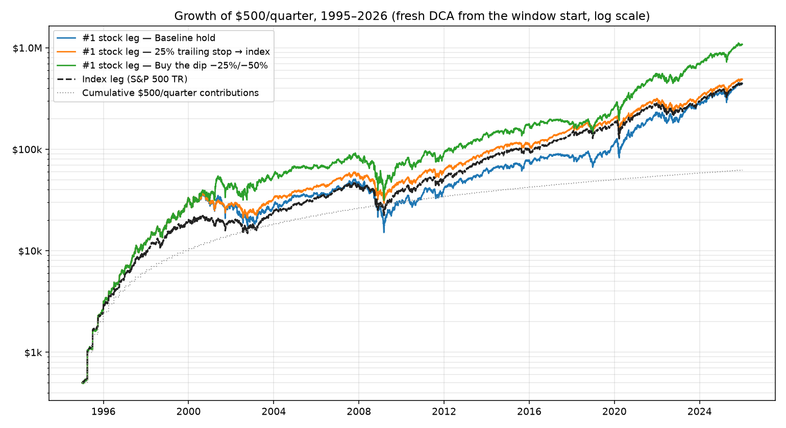
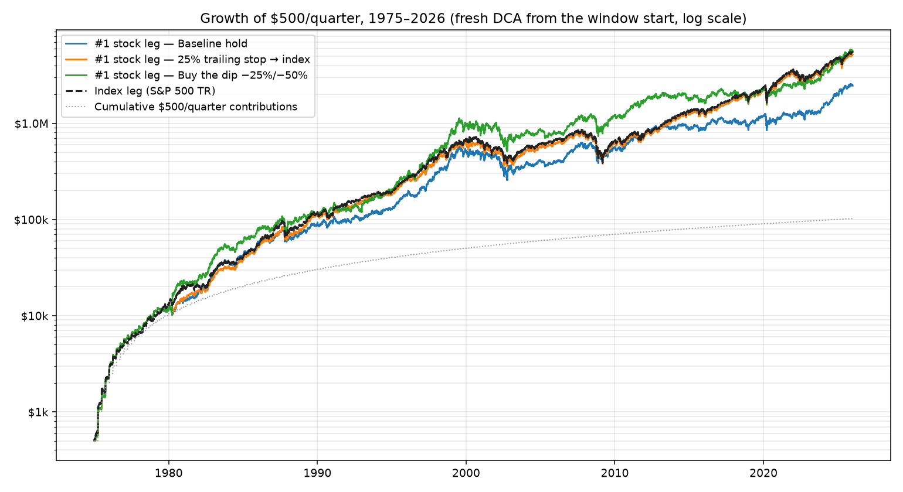
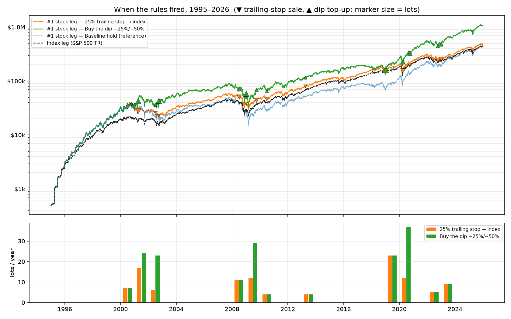

# Buying the #1 S&P 500 company every quarter, 1975–2026

**Setup.** On every quarter start from 1975-01-01 to 2026-01-01 (205 dates), $500 buys the largest S&P 500 company _as of the previous quarter-end close_ (no lookahead). Another $500 buys the S&P 500 total-return index. Everything is valued at the 2026-01-02 close. XIRRs are solved with `scipy.optimize.brentq` on the actual dated cashflows (`sp500bt/metrics.py`). They replace the old "multiple^(1/years)" approximation, which also ignored the index leg's contributions and the buy-the-dip top-ups.

**Bottom line.**

- **Buying and holding the #1 company underperformed the index:** 9.73% vs 11.87% XIRR, or $2.46M vs $5.51M from the same $102,500.
- **The gap comes entirely from 1975–1995 picks.** Routing only the pre-1996 picks to the index makes the strategy match the index (11.88%). A fresh backtest started on 1995-01-01 confirms it: the #1 stock leg ties the index (10.66% vs 10.68%), and both active rules beat it (see the cross-window comparison below).
- **The conclusion rests on the least certain part of the data, but not on the ambiguous rows within it.** Swapping every LOW-confidence pick for its runner-up moves the result by only −0.04 pp. What drives it is IBM's 1987–93 collapse and the AT&T breakup, not uncertainty about who was #1.

## Cross-window comparison: 1975–2026 vs 1995–2026

**What the 1995–2026 rows are.** They are **new, independent backtests**, not a checkpoint or slice of the 1975 run. Each starts with $0 on 1995-01-01, adds $500/quarter to each leg from 1995-01-01, uses the same picker, table and rules, and is valued at the 2026-01-02 close. The 1975–2026 rows and the top-10 row are read from `results/scenarios.csv`. `scripts/compare_windows.py` re-simulates them only to draw the charts, and asserts that the re-runs reproduce the stored numbers exactly.

| Scenario                           | Window                          | Stock-leg invested | Stock-leg final | Stock-leg XIRR | Index-leg invested | Index-leg final | Index-leg XIRR | Combined final | Combined XIRR |
| ---------------------------------- | ------------------------------- | -----------------: | --------------: | -------------: | -----------------: | --------------: | -------------: | -------------: | ------------: |
| Baseline hold                      | 1975–2026                       |           $102,500 |      $2,460,375 |          9.73% |           $102,500 |      $5,508,523 |         11.87% |     $7,968,898 |        11.02% |
| 25% trailing stop → index          | 1975–2026                       |           $102,500 |      $5,200,079 |         11.72% |           $102,500 |      $5,508,523 |         11.87% |    $10,708,602 |        11.80% |
| Buy the dip −25%/−50%              | 1975–2026                       |           $270,500 |      $5,565,832 |         10.28% |           $102,500 |      $5,508,523 |         11.87% |    $11,074,355 |        11.00% |
| Baseline hold                      | 1995–2026                       |            $62,500 |        $442,341 |         10.66% |            $62,500 |        $444,487 |         10.68% |       $886,828 |        10.67% |
| 25% trailing stop → index          | 1995–2026                       |            $62,500 |        $488,826 |         11.14% |            $62,500 |        $444,487 |         10.68% |       $933,313 |        10.92% |
| Buy the dip −25%/−50%              | 1995–2026                       |           $150,500 |      $1,078,642 |         11.30% |            $62,500 |        $444,487 |         10.68% |     $1,523,129 |        11.10% |
| Top-10 equal-weight, baseline hold | **2006–2026 (from 2006-04-01)** |            $40,000 |        $207,746 |         14.67% |            $40,000 |        $178,311 |         13.41% |       $386,057 |        14.07% |

Same table: `results/scenario_comparison.csv`. The buy-the-dip "invested" figures include its top-ups, $168,000 over 1975–2026 and $88,000 over 1995–2026.

> **The top-10 row runs on a different window (2006-04-01 → 2026-01-02, the only period with complete top-10 lists).** Its 14.67% XIRR is not comparable with the 1995–2026 top-1 rows. 2006–2026 was a stronger market (index leg 13.41% vs 10.68%), so compare the top-10 row only with its own index leg.

**Does restricting to 1995–2026 close the gap? Yes, for buy-and-hold.** Measured directly rather than assumed from the 1975 result, the fresh 1995 run's #1 stock leg earned 10.66% vs 10.68% for the index: $442,341 vs $444,487 on the same $62,500. That's a 0.02-point shortfall, compared with 2.14 points over 1975–2026. Both active rules come out ahead of the index in this window: trailing stop +0.46 points, buy-the-dip +0.62 points on its larger capital. How closely the tie holds depends on the start year. An earlier 1996-01-01 start (sensitivity table below) gave 10.85% vs 10.66%. The difference is the four 1995 contributions, all into GE, which grew 12.5–16.0× by 2026 vs 20.4–26.5× for the index. That's about $17.7k less on $2,000 invested, which is enough to cancel the #1 pick's edge from 1996 on. So the honest reading is that from the mid-1990s the #1 pick was roughly index-like: not a reliable winner, not a loser.

**Cross-check against the full-period run (no silent trust in either number).** Rules act on each lot independently. A fresh 1995 run should therefore equal exactly the subset of the 1975 run made up of lots first bought on or after 1995-01-01, plus the index units bought with those lots' stop/deal proceeds (`results/window_reconciliation.csv`):

| Rule              | Fresh 1995 stock-leg final | 1975 run, lots bought from 1995 |     Rule events (fresh / same lots in 1975 run) | Extra events in 1975 run after 1995, from pre-1995 lots |
| ----------------- | -------------------------: | ------------------------------: | ----------------------------------------------: | ------------------------------------------------------: |
| Baseline hold     |                $442,341.39 |                     $442,341.39 |                                           0 / 0 |   36 (corporate-action conversions of the AT&T lineage) |
| 25% trailing stop |                $488,825.73 |                     $488,825.73 | 110 / 110, identical dates, tickers and actions |                                                      49 |
| Buy the dip       |              $1,078,641.79 |                   $1,078,641.79 |                            176 / 176, identical |                                                     222 |

Picks and triggers are identical over the overlap; invested amounts and index legs also match to the cent. A 1995 slice of the 1975 run is **not** the same as a fresh start, because its pre-1995 lots keep firing after 1995. That's the "extra events" column; those events belong to the 1975 run only.

### Charts

Colors are fixed across all charts: blue = baseline hold, orange = 25% trailing stop, green = buy the dip, black dashed = index leg, purple = top-10.


_Figure 1: Fresh 1995–2026 DCA (log scale). Baseline hold finishes level with the index ($442k vs $444k): it led the index every day from 1996 through 2007, then trailed it from 2008 onward as GE and Exxon lots lagged; the trailing stop ends slightly above it; buy-the-dip ends highest because it also invested more._


_Figure 2: The same scenarios over 1975–2026. Baseline hold falls behind during IBM's 1987–93 slide and never catches up; the trailing stop converges onto the index line as its stops move lots into the index._


_Figure 3: Drawdown of each leg's time-weighted unit value (contributions stripped out) with the rule triggers below. The trailing stop cuts the 2009 trough from −76% to −53%; buy-the-dip deepens it slightly (−77%) and recovers faster afterwards._


_Figure 4: Stock-leg XIRR by rule. Solid = 1975–2026, hatched = 1995–2026, black marker = the index leg over the same window. The baseline's shortfall (solid blue under its marker) disappears in the hatched bar; the top-10 panel is on its own window._


_Figure 5: Where the trailing-stop sales (▼) and dip top-ups (▲) fired, and lots affected per year. Activity clusters in 2000–02, 2008–10 and 2019–23; the rules sat idle for years at a time._

## Results

### Main scenarios (1975-01-01 → valued 2026-01-02)

"Strategy" = the #1-stock leg, including index units bought with its own stop-loss proceeds or deal cash. "Index" = the $500/quarter index leg.

| Scenario                       | Strategy invested | Strategy ending value | Multiple |   XIRR | Index invested | Index ending value | Multiple |   XIRR | Combined value | Combined multiple | Combined XIRR |
| ------------------------------ | ----------------: | --------------------: | -------: | -----: | -------------: | -----------------: | -------: | -----: | -------------: | ----------------: | ------------: |
| #1 — baseline hold             |          $102,500 |            $2,460,375 |   24.00x |  9.73% |       $102,500 |         $5,508,523 |   53.74x | 11.87% |     $7,968,898 |            38.87x |        11.02% |
| #1 — 25% trailing stop → index |          $102,500 |            $5,200,079 |   50.73x | 11.72% |       $102,500 |         $5,508,523 |   53.74x | 11.87% |    $10,708,602 |            52.24x |        11.80% |
| #1 — buy the dip −25%/−50%     |          $270,500 |            $5,565,832 |   20.58x | 10.28% |       $102,500 |         $5,508,523 |   53.74x | 11.87% |    $11,074,355 |            29.69x |        11.00% |

- **Trailing stop:** 222 lot-level stops, each moving that lot into the index. It rescued most of the IBM and GE lots but still finished slightly behind the index.
- **Buy the dip:** 400 top-ups added $168,000 of new money. The multiple falls because more capital went in; judge this rule by its XIRR (10.28%), which accounts for when each dollar was added.
- **Rule semantics** are unchanged from the original framework: rules are checked on contribution dates only (quarterly), and the peak is measured per lot since purchase. **One deliberate change:** a dip top-up now equals the triggering lot's original purchase, and top-up lots cannot trigger further top-ups. Under the original code a top-10 slice worth $50 received a flat $500, and top-ups compounded into a cascade of new money.

### Top-10 equal-weight variant (2006-04-01 → 2026-01-02)

Top-10 lists are only COMPLETE from the 2006-03-31 observation. Before that they are either missing or survivorship-biased (see Known gaps), so this variant covers 80 quarters. The #1 pick is shown over the same window for comparison.

| Scenario                         | Strategy invested | Strategy ending value | Multiple |   XIRR | Index invested | Index ending value | Multiple |   XIRR | Combined value | Combined multiple | Combined XIRR |
| -------------------------------- | ----------------: | --------------------: | -------: | -----: | -------------: | -----------------: | -------: | -----: | -------------: | ----------------: | ------------: |
| Top-10 EW — baseline             |           $40,000 |              $207,746 |    5.19x | 14.67% |        $40,000 |           $178,311 |    4.46x | 13.41% |       $386,057 |             4.83x |        14.07% |
| Top-10 EW — trailing stop        |           $40,000 |              $165,584 |    4.14x | 12.80% |        $40,000 |           $178,311 |    4.46x | 13.41% |       $343,894 |             4.30x |        13.11% |
| Top-10 EW — buy the dip          |           $76,200 |              $402,165 |    5.28x | 16.00% |        $40,000 |           $178,311 |    4.46x | 13.41% |       $580,475 |             5.00x |        15.09% |
| #1 (same window) — baseline      |           $40,000 |              $230,590 |    5.76x | 15.53% |        $40,000 |           $178,311 |    4.46x | 13.41% |       $408,901 |             5.11x |        14.54% |
| #1 (same window) — trailing stop |           $40,000 |              $153,060 |    3.83x | 12.14% |        $40,000 |           $178,311 |    4.46x | 13.41% |       $331,371 |             4.14x |        12.80% |
| #1 (same window) — buy the dip   |           $84,500 |              $470,083 |    5.56x | 17.30% |        $40,000 |           $178,311 |    4.46x | 13.41% |       $648,394 |             5.21x |        15.96% |

2006–2026 was the mega-cap-tech era (Apple, Microsoft, Nvidia), so both concentrated strategies beat the index here. The trailing stop hurt in this window: stops fired in clusters (2008–09, 2015–16, 2018–20, 2022), and each time the proceeds sat in the index while the mega-caps rebounded.

## How much of the conclusion rests on shaky data?

Phase 1 grades each of the 205 rows (`data/largest_company_by_quarter.csv`):

|                                                                        | Rows | Dollars into #1 | Share of baseline ending value |
| ---------------------------------------------------------------------- | ---: | --------------: | -----------------------------: |
| HIGH (≥2 independent sources agree, margin ≥2%)                        |  112 |   $56,000 (55%) |                   27% ($0.67M) |
| MEDIUM (one exact-date source consistent with anchors, or thin margin) |   82 |   $41,000 (40%) |                   61% ($1.49M) |
| LOW (sources disagree, or margin inside the estimate's error band)     |   11 |     $5,500 (5%) |                   12% ($0.30M) |

By era: 1975–1995 has 20 HIGH / 54 MEDIUM / 10 LOW rows, and 1996–2026 has 92 HIGH / 28 MEDIUM / 1 LOW. Because early dollars compound longest, **73% of the baseline's ending value comes from MEDIUM/LOW rows**, almost all of them 1975–1995 quarters. There, the #1 comes from my own market-cap estimates (share counts from annual reports and filings × historical prices), checked against year-end vendor ranks.

Sensitivity of each rule's strategy-leg XIRR (and ending value):

| Sensitivity                                      |   Baseline hold | Trailing stop 25% |     Buy the dip |
| ------------------------------------------------ | --------------: | ----------------: | --------------: |
| Main result (as built)                           |  9.73% ($2.46M) |   11.72% ($5.20M) | 10.28% ($5.57M) |
| LOW rows switched to their alt pick              |  9.69% ($2.43M) |   11.63% ($5.02M) | 10.33% ($5.83M) |
| LOW rows → index instead of #1                   | 10.06% ($2.78M) |   11.66% ($5.09M) | 10.46% ($5.79M) |
| MEDIUM+LOW rows → index                          | 11.56% ($4.90M) |   11.79% ($5.33M) | 11.54% ($5.97M) |
| All pre-1996 rows → index                        | 11.88% ($5.52M) |   11.87% ($5.51M) | 11.90% ($6.15M) |
| Window 1996-01-01 onward only (index leg 10.66%) |          10.85% |            10.63% |          11.63% |

Reading it:

- **The 11 LOW rows barely matter to _which_ stock was picked.** Replacing each with its runner-up moves results by ≤0.2 pp, because the contested pairs (IBM vs AT&T in 1977–82, Exxon vs IBM in 1990, GE vs AT&T Corp in 1994–95) mostly had similar subsequent paths.
- **The underperformance is an era result, and that era is where the data is weakest.** The 84 pre-1996 contributions ($42,000) ended at about $3.1M _less_ than the same money in the index. The main culprits are IBM lots bought in 1983–1990 (IBM fell ~75% from its 1987 peak to 1993) and the AT&T basket (below). In the better-sourced 1996–2026 period, the #1 strategy was roughly index-like.
- **Whether a MEDIUM row picked the right #1 barely matters; how the pre-1996 picks performed matters a lot.** If you distrust the 1975–1995 estimates entirely, the defensible conclusion is the 1996+ one: owning the #1 was about as good as owning the index.

## Corporate-action and continuity decisions that moved the result

1. **AT&T's 1984 breakup (material).** Old AT&T was #1 at 16 quarter starts (1975-01, 1977-07/10, 1978-04/07/10, 1980-04/07/10, 1981-04 through 1982-10). Each lot is held through divestiture and split by the IRS basis allocation:
   - 28.67% into new AT&T Corp, tracked on its own monthly series to the 2005 SBC merger.
   - 46.37% into the SBC line (Yahoo `T`): Southwestern Bell exactly, plus Ameritech, Pacific Telesis and BellSouth, which were absorbed into SBC/AT&T Inc later and are proxied by SBC before their mergers.
   - 24.96% into the Bell Atlantic line (`VZ`): Bell Atlantic exactly, plus NYNEX (merged in 1997).
   - US West (9.0%) is proxied half-and-half by SBC and Bell Atlantic.

   Each 1984 dollar of this basket grew 62× by 2026, vs 108× for the index. Treatment changes the result materially:
   - **Selling old AT&T at the 1983-12-30 close** and moving the proceeds to the index instead lifts the baseline to 10.29% (+0.56 pp, **+$579k**, +24% of strategy value). It _lowers_ the trailing-stop result to 11.41% (−0.31 pp). The basket beat the index from 1984 to 2000 (19.5× vs 14.3×) before the telecom bust, and under the trailing stop most basket lots were stopped into the index in 2000–02, near that peak. Selling in 1983 gives up that run.
   - **Writing US West's share off entirely** (a lower bound for its real Qwest/CenturyLink path) costs only −0.09 pp / −$80k.
   - The old-AT&T lineage is **$0.78M of the baseline's $2.46M**.

2. **SBC acquisition of AT&T Corp (2005-11-18).** The consideration was 0.77942 SBC shares **plus a $1.30/share special dividend**, per the merger proxy on EDGAR. Modelling only the share ratio would have silently lost 6.4% of every AT&T Corp lot. The cash is sent to the index leg, per the framework's convention for deal cash.
3. **Old-GM bankruptcy (2009) does not arise.** GM never ranked #1 at a quarter-end in 1975–2026 (Morgan Stanley's data last shows it in the top 3 in 1971). The `bankruptcy` mode exists in the engine but is unused.
4. **Exxon + Mobil (1999).** Exxon was the acquirer and legal survivor; the ticker moved from XON to XOM, and Yahoo's XOM history is Exxon's, so it is continuous with no action needed. All 25 of XOM's post-1999 #1 quarters are flagged "merged entity" in `structural_flag`. Its 2005–2013 dominance reflects a company roughly doubled by merger, plus the oil price.
5. **Spinoffs inside Yahoo's adjusted prices** (IBM/Kyndryl, the three GE spins, AT&T/WBD, Verizon's three spins, Pfizer/Viatris, Altria's Kraft and PMI spins booked as special dividends) are treated as "value reinvested in the parent". I checked the implied value fraction against the documented distribution terms, all within 1.8 pp (`results/price_sanity.csv`). No spinoff value is lost; it is simply not held as the separate stock.
6. **Ticker reuse.** Yahoo's `T` before Nov 2005 is **SBC**, not AT&T. Old AT&T (to 1983) and AT&T Corp (1984–2005) therefore use hand-built series (`T_OLD`, `T_CORP`), never Yahoo's `T`. Every other symbol used is a continuous legal entity on Yahoo: IBM, XOM, GE (now GE Aerospace), MSFT, AAPL, NVDA, and the top-10 names (`data/universe.csv`, `continuity_note`).

Structural caveats on #1 spells that reflect a corporate event rather than organic strength are in the table's `structural_flag` column:

- **Pre-breakup AT&T (1982–83):** the divestiture had already been agreed (1982-01-08).
- **AT&T Corp at 1994-10-01:** inflated by the McCaw Cellular stock deal.
- **Post-merger Exxon.**

Every #1 change, with the relative price move and dated news context, is in `data/top1_transitions.csv`.

## Phase 1 table vs the original starter table

The starter 2011–2026 table had several errors that the sourced table corrects:

- **2019-01-01:** Microsoft, not Apple. MSFT closed 2018 at $780B vs AAPL $746B; Morgan Stanley and FT agree.
- **2024-01-01:** Apple, not Microsoft ($2.99T vs $2.79T at the 2023 close).
- **2024-06-01 "NVDA":** Nvidia's close above Microsoft on 2024-06-18 was reversed before the quarter ended. The 2024-07-01 row is Microsoft, and Nvidia's first quarter-end #1 is 2025-06-30.
- **Missing flips:** the table now also captures Exxon/Apple trading places in 2011–2013 (Apple at 2011-09-30, Exxon at 2011-12-31 and 2013-06-30) and Microsoft at 2020-03-31.

## Known gaps and data caveats (logged, not hidden)

- **No Stooq fallback.** pandas-datareader 0.11 removed its Stooq reader, and stooq.com now puts downloads behind a JavaScript proof-of-work bot check, which I did not circumvent. In its place, the one family Yahoo lacks (old AT&T and AT&T Corp) is hand-built from sourced data. All 71 Yahoo series fetched cleanly (`results/price_fetch_report.csv`).
- **Old AT&T prices are month-end high–low averages** of the last trading day, not closes (±0.5%). AT&T Corp's **1998 month-ends are log-interpolated** between dividend-date prices because the source table skips 1998.
- **Top-10 lists:** UNRESOLVED for 1975–1995 (no source for full lists), PARTIAL for 1996–2005 (companiesmarketcap lacks delisted giants such as AT&T Corp, Lucent, AOL/Time Warner and BellSouth, so lists there are survivorship-biased), COMPLETE from 2006. The top-10 variant therefore runs 2006–2026 only.
- **IBM's 1974–75 share counts are extrapolated.** The 1975-01-01 row (AT&T by Morgan Stanley; IBM by my estimate, 0.8% apart) is LOW for that reason.
- **Third-party source errors I found and corrected or excluded:**
  - Wikipedia's 2024 Q2/Q3 Apple/Microsoft labels are transposed.
  - Wikipedia's 2002/2003 FT tables are March data labelled "December".
  - finhacker.cz's survivorship-biased S&P list was rejected.
  - My own first read of the Morgan Stanley exhibit had one row mislabeled (P&G read as "Intel"); fixed.
- **The index leg before 1988** is ^GSPC plus Shiller dividends. Over 1988–2023 that method trails ^SP500TR by 0.06%/yr (daily correlation 0.9996), and its calendar-year returns match published S&P 500 totals within 0.5 pp.
- **Price sanity checks** (`scripts/check_prices.py`): every symbol that was ever a #1 pick matches at least one independent dated print (UPI, Washington Post, NBC, CNBC, Seattle Times, SEC filings, Wollman), all within 2%. Every universe ticker's price is also cross-checked against companiesmarketcap's market cap.

## Reproduce

```py
source .venv/bin/activate
python scripts/fetch_sources.py        # automatable sources (browser-only ones are committed; see data/sources/README.md)
python scripts/cache_prices.py         # Yahoo cache + failure report
python scripts/build_manual_prices.py  # T_OLD, T_CORP, SPX_TR
python scripts/build_top_table.py      # Phase 1 table + transitions
python scripts/check_prices.py         # Phase 3 sanity checks
python scripts/run_scenarios.py        # Phase 4 results
python scripts/compare_windows.py      # fresh 1995-2026 runs, comparison table, reconciliation, charts/
python tests/test_backtest.py          # engine reconciles to a closed-form valuation to 1e-9
```
