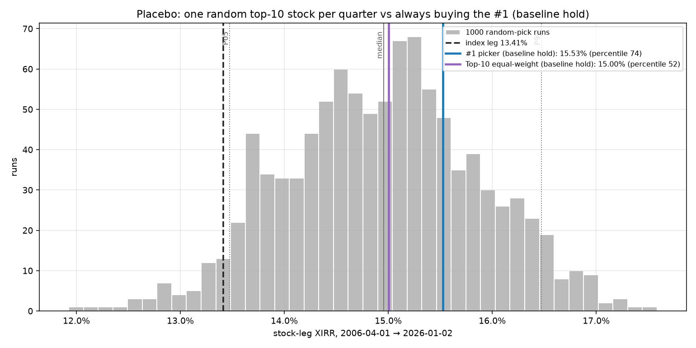

# Random-pick placebo: is the #1 special?

[← index](../REPORT.md) · config: [`scenarios/random_pick_placebo.toml`](../scenarios/random_pick_placebo.toml) · results: [`results/random_pick_placebo/`](../results/random_pick_placebo/)

**Question.** Does buying the single largest company add anything beyond "own some mega-cap"? Or would any top-10 stock, held the same way, have done about as well?

**Design.**
- 1,000 independent simulations. Each quarter from **2006-04-01**, one ticker is drawn uniformly at random from that quarter's top-10 list and held with the baseline-hold rule ($500/quarter, valued 2026-01-02).
- 2006-04-01 is the first quarter with a COMPLETE top-10 list; the 2006-01-01 list is PARTIAL. It is also the start of the existing #1 comparison run, so the ranking is like-for-like.
- The #1 itself is one of the ten candidates, so random runs drew it in 10.2% of quarters on average.
- Seeds are `20260918 + i`, so every run is reproducible.
- Only per-run summary statistics are stored (`sims.csv`: XIRR, plus Sharpe, Sortino and max drawdown per leg); lot-by-lot histories are not.
- The window is not extended before 2006: a reliable random-draw universe there would need the same point-in-time research as the original #1 table.

| Random-pick stock-leg XIRR | Value |
|---|---:|
| Mean / median | 14.58% / 14.56% |
| Standard deviation | 1.01 pp |
| 5th / 25th / 75th / 95th percentile | 13.00% / 13.86% / 15.33% / 16.31% |
| Min / max | 11.59% / 17.49% |
| Index leg, same window | 13.41% |
| Share of random runs beating the index | 86.9% |

| Reference strategy | XIRR | Percentile rank among 1,000 random runs | z-score |
|---|---:|---:|---:|
| **#1 picker, baseline hold** | 15.53% | **80th** | 0.93 |
| Top-10 equal-weight, baseline hold | 14.67% | 54th | 0.09 |

**Risk-adjusted** (monthly Sharpe and Sortino against 3-month T-bills, max drawdown of the daily unit value; [definitions](risk_metrics.md)):

| Random-pick stock leg | Sharpe | Sortino | Max drawdown |
|---|---:|---:|---:|
| Mean | 0.69 | 1.06 | −53% |
| 5th / 50th / 95th percentile | 0.52 / 0.69 / 0.83 | 0.76 / 1.06 / 1.34 | −67% / −52% / −38% |
| Index leg, same window | 0.66 | 0.98 | −55% |
| Share of random runs with a higher Sharpe than the index | 63.3% | | |

| Reference strategy | Sharpe | Sharpe percentile rank | Max drawdown | Share of random runs with a deeper drawdown |
|---|---:|---:|---:|---:|
| **#1 picker, baseline hold** | 0.67 | **42nd** | −37% | 95.9% |
| Top-10 equal-weight, baseline hold | 0.72 | 62nd | −51% | 55.1% |

_Random single-stock picks from each quarter's top-10 (grey), with the real #1 picker (blue), top-10 equal-weight (purple) and the index leg (black dashed)._

**Interpretation.**
- **The #1 picker is not in a tail.** It sits at the 80th percentile, about one standard deviation above the random mean: one in five random mega-cap sequences did as well or better. That is outside the interquartile range, so it is weak evidence that #1 picking did somewhat better than a random mega-cap. It is nowhere near the 5% tail that would mark a distinctive edge. Over 2006–2026 the "#1" framing adds at most a modest, statistically unremarkable edge over "own a random mega-cap".
- **Most of the outperformance comes from the era, not the pick.** 87% of the random runs beat the index, and the average random pick earned 14.58% against the index's 13.41%. Over 2006–2026 almost any concentrated mega-cap holding beat the index. So the #1 picker's +2.1 pp over the index in this window is mostly mega-cap exposure (about +1.2 pp for the average random pick), with about +0.9 pp specific to picking the #1.
- **Risk-adjusted, the #1's edge disappears.** It ranks 80th on XIRR but only 42nd on Sharpe, below the median random pick.
  - Its extra return came with extra volatility: from 2012 every new dollar went into one stock at a time (Apple, then Microsoft and Nvidia), so a few names dominated the leg.
  - Its drawdown is unusually shallow (−37%, shallower than 96% of random runs) only because Exxon, the #1 from 2006 to 2011, fell less than most mega-caps in 2008–09.
  - Top-10 equal-weight, which is simply more diversified, ranks higher on Sharpe (62nd) than the #1.
- **Equal-weighting the top-10 is exactly the "typical" outcome.** It lands at the 54th percentile, as expected for an average of the draws.
- **Caveat:** this is one 20-year window that happened to reward mega-caps. It says nothing about 1975–1995, when the #1 (IBM, then old AT&T) did much worse than the index, and it cannot be extended there without new data work.
