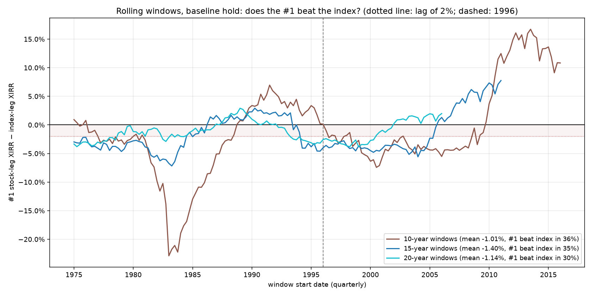

# Rolling-window robustness: is the post-1995 tie a real property?

[← index](../REPORT.md) · config: [`scenarios/rolling_windows.toml`](../scenarios/rolling_windows.toml) · results: [`results/rolling_windows/`](../results/rolling_windows/) (`windows.csv` has every window)

**Design.**
- For every 10-, 15- and 20-year window starting at a quarter start from 1975-01-01 and ending by 2026-01-01 (165 + 145 + 125 = 435 windows), a fresh baseline-hold DCA run: $500/quarter into the #1 and into the index, valued at the close before the window's anniversary.
- **Spread** = #1 stock-leg XIRR − index-leg XIRR.
- The engine is reused unchanged. Three windows were independently re-computed with the closed form ($500 × each pick's total-return growth) and match to four decimals.
- **Overlapping windows share most of their quarters, so they are not independent observations.** 145 fifteen-year windows over 51 years carry roughly three to five independent 15-year periods' worth of information, so treat percentages below as descriptive, not as test statistics.

_Spread (#1 minus index XIRR) by window start date. Brown = 10-year, blue = 15-year, teal = 20-year windows. Shading marks a lag of up to 2 pp; the dashed line is 1996._

| Window length | Windows | Mean spread | Median spread | #1 beat the index | #1 lagged by > 2 pp | Within ±1 pp |
|---|---:|---:|---:|---:|---:|---:|
| 10 years | 165 | −1.0 pp | −2.4 pp | 36% | 53% | 8% |
| 15 years | 145 | −1.4 pp | −3.0 pp | 35% | 58% | 9% |
| 20 years | 125 | −1.1 pp | −1.3 pp | 30% | 40% | 29% |

By start era (mean spread / share of windows where the #1 beat the index):

| Starts in | 10-year | 15-year | 20-year |
|---|---:|---:|---:|
| 1975–1984 | −6.6 pp / 10% | −4.0 pp / 0% | −2.1 pp / 0% |
| 1985–1995 | −0.2 pp / 66% | +0.2 pp / 66% | −0.4 pp / 48% |
| 1996–2008 | −3.7 pp / 2% | −2.1 pp / 25% | −1.0 pp / 41% |
| 2009 onward | +10.5 pp / 90% | +6.3 pp / 100% (9 windows) | — |

**What this says.** The rolling windows **undermine** the reading that "from the mid-1990s the #1 pick was roughly index-like" is a durable property. The spread doesn't narrow toward zero after 1995. It swings between long regimes:
- **Starts in 1975–84 lag**, because IBM and pre-breakup AT&T were bought near their peaks. The 10-year windows starting 1982–83 lag by up to 23 pp.
- **Starts in 1985–95 are slightly ahead**, because the 10- and 15-year windows catch GE's 1990s run.
- **Starts in 1996–2008 lag by 2–7 pp**, because GE, Microsoft and Exxon were bought near their 2000-era highs.
- **Starts from 2009 are far ahead**: Apple, then Microsoft and Nvidia, +8 to +17 pp over 10 years.

The single 1995–2026 window ties (10.66% vs 10.68%) because a decade of bad picks and a decade of spectacular ones happen to net out. Starting a few years earlier or later, or measuring over a shorter horizon, gives a large gap in either direction. The pattern holds at all three window lengths; longer windows only smooth the swings (the 20-year spreads stay within about ±4 pp).

**Takeaway.**
- **The #1 strategy is a regime bet, not an index substitute.** Over most 10–20-year horizons it lagged the index, typically by 1–4 pp, and 30–36% of windows beat it.
- **Whether it wins depends mostly on which mega-cap era the window catches.**
- **"Index-like over 1995–2026" is a true statement about that one window, not a property of the strategy.**
