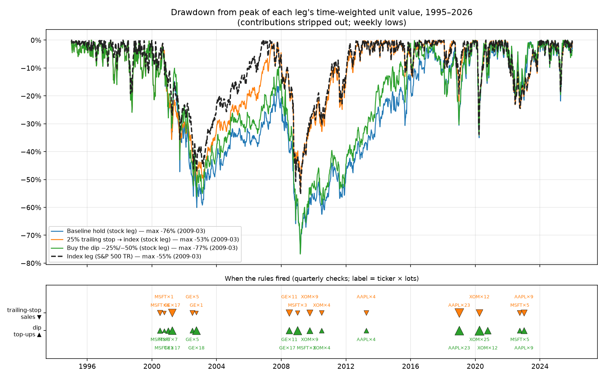
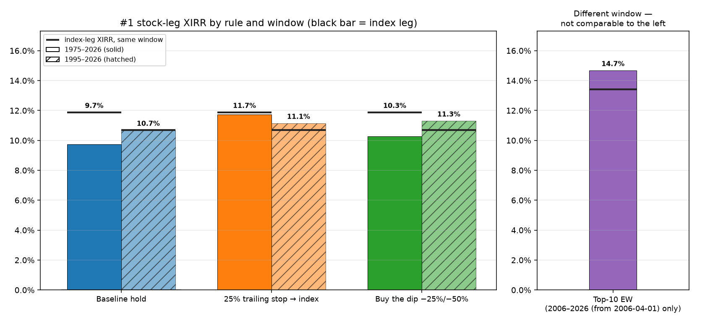

# #1 company: three rules, 1975–2026 and 1995–2026

[← index](../REPORT.md) · config: [`scenarios/top1_core.toml`](../scenarios/top1_core.toml) · results: [`results/top1_core/`](../results/top1_core/)

**Setup.** On every quarter start from 1975-01-01 to 2026-01-01 (205 dates), $500 buys the largest S&P 500 company _as of the previous quarter-end close_ (no lookahead). Another $500 buys the S&P 500 total-return index. Everything is valued at the 2026-01-02 close. XIRRs are solved with `scipy.optimize.brentq` on the actual dated cashflows (`sp500bt/metrics.py`). They replace the old "multiple^(1/years)" approximation, which also ignored the index leg's contributions and the buy-the-dip top-ups.

**_Main scenarios (1975-01-01 → valued 2026-01-02)_**

"Strategy" = the #1-stock leg, including index units bought with its own stop-loss proceeds or deal cash. "Index" = the $500/quarter index leg.

| Scenario                       | Strategy invested | Strategy ending value | Multiple |   XIRR | Sharpe | Sortino | Max DD | Index invested | Index ending value | Multiple |   XIRR | Sharpe | Sortino | Max DD | Combined value | Combined multiple | Combined XIRR | Combined Sharpe |
| ------------------------------ | ----------------: | --------------------: | -------: | -----: | -----: | ------: | -----: | -------------: | -----------------: | -------: | -----: | -----: | ------: | -----: | -------------: | ----------------: | ------------: | --------------: |
| #1 — baseline hold             |          $102,500 |            $2,460,375 |   24.00x |  9.73% |   0.43 |    0.68 |   −57% |       $102,500 |         $5,508,523 |   53.74x | 11.87% |   0.58 |    0.87 |   −55% |     $7,968,898 |            38.87x |        11.02% |            0.55 |
| #1 — 25% trailing stop → index |          $102,500 |            $5,200,079 |   50.73x | 11.72% |   0.58 |    0.88 |   −53% |       $102,500 |         $5,508,523 |   53.74x | 11.87% |   0.58 |    0.87 |   −55% |    $10,708,602 |            52.24x |        11.80% |            0.59 |
| #1 — buy the dip −25%/−50%     |          $270,500 |            $5,565,832 |   20.58x | 10.28% |   0.42 |    0.67 |   −58% |       $102,500 |         $5,508,523 |   53.74x | 11.87% |   0.58 |    0.87 |   −55% |    $11,074,355 |            29.69x |        11.00% |            0.52 |

- **Trailing stop:** 222 lot-level stops, each moving that lot into the index. It rescued most of the IBM and GE lots but still finished slightly behind the index.
- **Buy the dip:** 400 top-ups added $168,000 of new money. The multiple falls because more capital went in; judge this rule by its XIRR (10.28%), which accounts for when each dollar was added.
- **Risk-adjusted:** Sharpe, Sortino and max drawdown come from the monthly time-weighted unit value, with 3-month T-bills as the risk-free rate ([definitions](risk_metrics.md)).
  - The trailing stop is level with the index on Sharpe (0.575 vs 0.582) and has a slightly shallower worst drawdown (−53% vs −55%).
  - Baseline hold (0.43) and buy-the-dip (0.42) are worse on both return and risk. Their worst fall is the 1999–2002 slide of GE, Microsoft and friends (−57%/−58%), which took 8–9 years to recover.
- **Rule semantics** are unchanged from the original framework: rules are checked on contribution dates only (quarterly), and the peak is measured per lot since purchase. **One deliberate change:** a dip top-up now equals the triggering lot's original purchase, and top-up lots cannot trigger further top-ups. Under the original code a top-10 slice worth $50 received a flat $500, and top-ups compounded into a cascade of new money.

## Cross-window comparison: 1975–2026 vs 1995–2026

**What the 1995–2026 rows are.** They are **new, independent backtests**, not a checkpoint or slice of the 1975 run. Each starts with $0 on 1995-01-01, adds $500/quarter to each leg from 1995-01-01, uses the same picker, table and rules, and is valued at the 2026-01-02 close. The 1975–2026 rows and the top-10 row are read from `results/all_runs.csv`. The runner (`python -m sp500bt.run top1_core`) produces all of them; the `window_reconciliation` analysis asserts the cross-check below.

| Scenario                           | Window                          | Stock-leg invested | Stock-leg final | Stock-leg XIRR | Stock Sharpe | Stock Sortino | Stock max DD | Index-leg invested | Index-leg final | Index-leg XIRR | Index Sharpe | Index Sortino | Index max DD | Combined final | Combined XIRR | Combined Sharpe |
| ---------------------------------- | ------------------------------- | -----------------: | --------------: | -------------: | -----------: | ------------: | -----------: | -----------------: | --------------: | -------------: | -----------: | ------------: | -----------: | -------------: | ------------: | --------------: |
| Baseline hold                      | 1975–2026                       |           $102,500 |      $2,460,375 |          9.73% |         0.43 |          0.68 |         −57% |           $102,500 |      $5,508,523 |         11.87% |         0.58 |          0.87 |         −55% |     $7,968,898 |        11.02% |            0.55 |
| 25% trailing stop → index          | 1975–2026                       |           $102,500 |      $5,200,079 |         11.72% |         0.58 |          0.88 |         −53% |           $102,500 |      $5,508,523 |         11.87% |         0.58 |          0.87 |         −55% |    $10,708,602 |        11.80% |            0.59 |
| Buy the dip −25%/−50%              | 1975–2026                       |           $270,500 |      $5,565,832 |         10.28% |         0.42 |          0.67 |         −58% |           $102,500 |      $5,508,523 |         11.87% |         0.58 |          0.87 |         −55% |    $11,074,355 |        11.00% |            0.52 |
| Baseline hold                      | 1995–2026                       |            $62,500 |        $442,341 |         10.66% |         0.52 |          0.82 |         −76% |            $62,500 |        $444,487 |         10.68% |         0.62 |          0.92 |         −55% |       $886,828 |        10.67% |            0.59 |
| 25% trailing stop → index          | 1995–2026                       |            $62,500 |        $488,826 |         11.14% |         0.67 |          1.08 |         −53% |            $62,500 |        $444,487 |         10.68% |         0.62 |          0.92 |         −55% |       $933,313 |        10.92% |            0.66 |
| Buy the dip −25%/−50%              | 1995–2026                       |           $150,500 |      $1,078,642 |         11.30% |         0.54 |          0.84 |         −77% |            $62,500 |        $444,487 |         10.68% |         0.62 |          0.92 |         −55% |     $1,523,129 |        11.10% |            0.57 |
| Top-10 equal-weight, baseline hold | **2006–2026 (from 2006-04-01)** |            $40,000 |        $207,746 |         14.67% |         0.72 |          1.10 |         −51% |            $40,000 |        $178,311 |         13.41% |         0.66 |          0.98 |         −55% |       $386,057 |        14.07% |            0.70 |

Same table: `results/scenario_comparison.csv`; risk columns from `results/risk_metrics.csv` (monthly Sharpe/Sortino vs 3-month T-bills, daily max drawdown of the time-weighted unit value; [definitions](risk_metrics.md)). The buy-the-dip "invested" figures include its top-ups, $168,000 over 1975–2026 and $88,000 over 1995–2026.

> **The top-10 row runs on a different window (2006-04-01 → 2026-01-02, the only period with complete top-10 lists).** Its 14.67% XIRR is not comparable with the 1995–2026 top-1 rows. 2006–2026 was a stronger market (index leg 13.41% vs 10.68%), so compare the top-10 row only with its own index leg.

**Does restricting to 1995–2026 close the gap? Yes, for buy-and-hold.** Measured directly rather than assumed from the 1975 result, the fresh 1995 run's #1 stock leg earned 10.66% vs 10.68% for the index: $442,341 vs $444,487 on the same $62,500. That's a 0.02-point shortfall, compared with 2.14 points over 1975–2026. Both active rules come out ahead of the index in this window: trailing stop +0.46 points, buy-the-dip +0.62 points on its larger capital. How closely the tie holds depends on the start year. An earlier 1996-01-01 start (see [sensitivities](sensitivities.md)) gave 10.85% vs 10.66%. The difference is the four 1995 contributions, all into GE, which grew 12.5–16.0× by 2026 vs 20.4–26.5× for the index. That's about $17.7k less on $2,000 invested, which is enough to cancel the #1 pick's edge from 1996 on. So the honest reading is that from the mid-1990s the #1 pick was roughly index-like: not a reliable winner, not a loser.

**On risk, the 1995–2026 tie is not a tie.** The equal XIRRs hide very different rides:

| 1995–2026            | #1 baseline hold          | Index                    |
| -------------------- | ------------------------- | ------------------------ |
| Volatility           | 21.2%                     | 15.1%                    |
| Sharpe               | 0.52                      | 0.62                     |
| Worst drawdown       | −76% (2000-08 → 2009-03)  | −55%                     |
| Back to the old peak | 2018-10, after 18.1 years | 2012-04, after 4.5 years |

- **Buy-the-dip** has the higher XIRR, but its Sharpe (0.54) is still below the index.
- **Only the trailing stop** beats the index on both XIRR and risk-adjusted terms: Sharpe 0.67 vs 0.62, Sortino 1.08 vs 0.92, worst drawdown −53%. See [risk metrics](risk_metrics.md).

**Cross-check against the full-period run (no silent trust in either number).** Rules act on each lot independently. A fresh 1995 run should therefore equal exactly the subset of the 1975 run made up of lots first bought on or after 1995-01-01, plus the index units bought with those lots' stop/deal proceeds (`results/top1_core/window_reconciliation.csv`):

| Rule              | Fresh 1995 stock-leg final | 1975 run, lots bought from 1995 |     Rule events (fresh / same lots in 1975 run) | Extra events in 1975 run after 1995, from pre-1995 lots |
| ----------------- | -------------------------: | ------------------------------: | ----------------------------------------------: | ------------------------------------------------------: |
| Baseline hold     |                $442,341.39 |                     $442,341.39 |                                           0 / 0 |   36 (corporate-action conversions of the AT&T lineage) |
| 25% trailing stop |                $488,825.73 |                     $488,825.73 | 110 / 110, identical dates, tickers and actions |                                                      49 |
| Buy the dip       |              $1,078,641.79 |                   $1,078,641.79 |                            176 / 176, identical |                                                     222 |

Picks and triggers are identical over the overlap; invested amounts and index legs also match to the cent. A 1995 slice of the 1975 run is **not** the same as a fresh start, because its pre-1995 lots keep firing after 1995. That's the "extra events" column; those events belong to the 1975 run only.

### Charts

Colors are fixed across all charts: blue = baseline hold, orange = 25% trailing stop, green = buy the dip, black dashed = index leg, purple = top-10.

_Figure 1: Fresh 1995–2026 DCA (log scale). Baseline hold finishes level with the index ($442k vs $444k): it led the index every day from 1996 through 2007, then trailed it from 2008 onward as GE and Exxon lots lagged; the trailing stop ends slightly above it; buy-the-dip ends highest because it also invested more._

_Figure 2: The same scenarios over 1975–2026. Baseline hold falls behind during IBM's 1987–93 slide and never catches up; the trailing stop converges onto the index line as its stops move lots into the index._

_Figure 3: Drawdown of each leg's time-weighted unit value (contributions stripped out) with the rule triggers below. The trailing stop cuts the 2009 trough from −76% to −53%; buy-the-dip deepens it slightly (−77%) and recovers faster afterwards._

_Figure 4: Stock-leg XIRR by rule. Solid = 1975–2026, hatched = 1995–2026, black marker = the index leg over the same window. The baseline's shortfall (solid blue under its marker) disappears in the hatched bar; the top-10 panel is on its own window._

_Figure 5: Where the trailing-stop sales (▼) and dip top-ups (▲) fired, and lots affected per year. Activity clusters in 2000–02, 2008–10 and 2019–23; the rules sat idle for years at a time._

## How much of the conclusion rests on shaky data?

Phase 1 grades each of the 205 rows (`data/largest_company_by_quarter.csv`):

|                                                                        | Rows | Dollars into #1 | Share of baseline ending value |
| ---------------------------------------------------------------------- | ---: | --------------: | -----------------------------: |
| HIGH (≥2 independent sources agree, margin ≥2%)                        |  112 |   $56,000 (55%) |                   27% ($0.67M) |
| MEDIUM (one exact-date source consistent with anchors, or thin margin) |   82 |   $41,000 (40%) |                   61% ($1.49M) |
| LOW (sources disagree, or margin inside the estimate's error band)     |   11 |     $5,500 (5%) |                   12% ($0.30M) |

By era: 1975–1995 has 20 HIGH / 54 MEDIUM / 10 LOW rows, and 1996–2026 has 92 HIGH / 28 MEDIUM / 1 LOW. Because early dollars compound longest, **73% of the baseline's ending value comes from MEDIUM/LOW rows**, almost all of them 1975–1995 quarters. There, the #1 comes from my own market-cap estimates (share counts from annual reports and filings × historical prices), checked against year-end vendor ranks.

Sensitivities to these grades and to the pre-1996 data are in [sensitivities](sensitivities.md).
